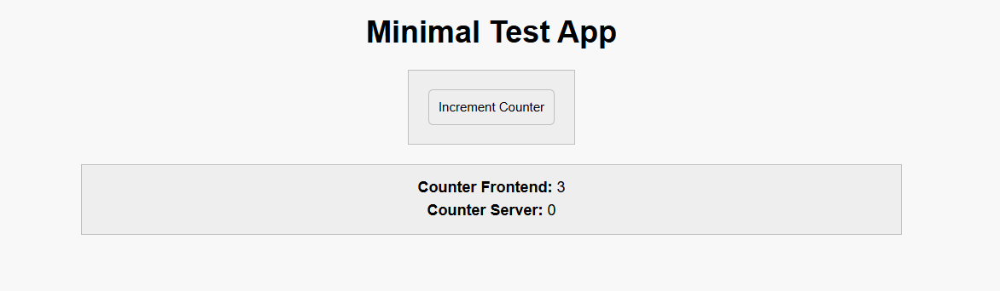

# Description
Simple example of web app in C++.

# How to run
#### Server:
```bash
make           # Builds the project
./bin/exec     # Runs the executable
```
#### Frontend
Open http://localhost:8080/ in web browser.

#### Clean:
```bash
make clean     # Cleans up build files
```

# Example
Terminal:
```terminal
Running
(2025-03-08 10:18:19) [INFO    ] Crow/1.0 server is running at http://0.0.0.0:8765 using 4 threads
(2025-03-08 10:18:19) [INFO    ] Crow/1.0 server is running at http://0.0.0.0:8080 using 4 threads
(2025-03-08 10:18:19) [INFO    ] Call `app.loglevel(crow::LogLevel::Warning)` to hide Info level logs.
(2025-03-08 10:18:19) [INFO    ] Call `app.loglevel(crow::LogLevel::Warning)` to hide Info level logs.
(2025-03-08 10:18:24) [INFO    ] Request: 127.0.0.1:51104 0x622000000100 HTTP/1.1 GET /
(2025-03-08 10:18:24) [INFO    ] Response: 0x622000000100 / 200 0
(2025-03-08 10:18:24) [INFO    ] Request: 127.0.0.1:51104 0x622000000100 HTTP/1.1 GET /css/styles.css
(2025-03-08 10:18:24) [INFO    ] Response: 0x622000000100 /css/styles.css 200 0
(2025-03-08 10:18:24) [INFO    ] Request: 127.0.0.1:51104 0x622000000100 HTTP/1.1 GET /js/script.js
(2025-03-08 10:18:24) [INFO    ] Response: 0x622000000100 /js/script.js 200 0
WebSocket client connected!
Received message: {"type":"handshake","timestamp":"1.1801"}
Received message: {"type":"increment","timestamp":"3.4710"}
Received message: {"type":"increment","timestamp":"4.0824"}
Received message: {"type":"increment","timestamp":"4.5811"}
Received message: {"type":"increment","timestamp":"5.1091"}
^C(2025-03-08 10:19:01) [INFO    ] Exiting.(2025-03-08 10:19:01) [INFO    ] Exiting.

Server stopped.
Execution is finished
```

Web console:
```terminal
script.js:25 Connect OK!
script.js:62 Sent: {"type":"handshake","timestamp":"1.1801"}
script.js:43 Got msg from backend at 1.1861s: {"type":"handshake_acknowledgement","timestamp":"1.1801"}
script.js:49 Handshake acknowledgement is received from server
script.js:62 Sent: {"type":"increment","timestamp":"3.4710"}
script.js:43 Got msg from backend at 3.4740s: {"type":"increment_acknowledgement","timestamp":"3.4710"}
script.js:45 Roundtrip time: 3.0ms
script.js:62 Sent: {"type":"increment","timestamp":"4.0824"}
script.js:43 Got msg from backend at 4.0852s: {"type":"increment_acknowledgement","timestamp":"4.0824"}
script.js:45 Roundtrip time: 2.8ms
script.js:62 Sent: {"type":"increment","timestamp":"4.5811"}
script.js:43 Got msg from backend at 4.5840s: {"type":"increment_acknowledgement","timestamp":"4.5811"}
script.js:45 Roundtrip time: 2.9ms
script.js:62 Sent: {"type":"increment","timestamp":"5.1091"}
script.js:43 Got msg from backend at 5.1115s: {"type":"increment_acknowledgement","timestamp":"5.1091"}
script.js:45 Roundtrip time: 2.4ms
```

Web page:


# Credits

This project uses the following open-source libraries:
- Crow (v1.0+5 Security Patch): [link](https://github.com/CrowCpp/Crow.git), [license](https://github.com/CrowCpp/Crow/blob/master/LICENSE)
