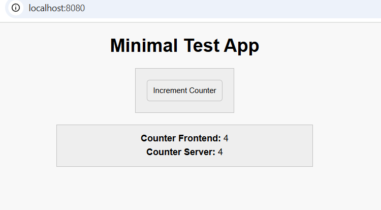

# Description
Simple example of web app in C++.

# How to run
#### Simulation:
```bash
make           # Builds the project
./bin/exec     # Runs the executable
```

#### Clean:
```bash
make clean     # Cleans up build files
```

# Example
Terminal:
```terminal
Running
(2025-03-04 19:29:52) [INFO    ] Crow/1.0 server is running at http://0.0.0.0:8080 using 4 threads
(2025-03-04 19:29:52) [INFO    ] Call `app.loglevel(crow::LogLevel::Warning)` to hide Info level logs.
^C(2025-03-04 19:29:58) [INFO    ] Exiting.
Server stopped.
Execution is finished
```

Web console:
```terminal
script.js:25 Connect OK!
script.js:62 Sent: {"type":"handshake","timestamp":"1.025"}
script.js:43 Got msg from backend at 1.051s: {"type": "handshake_acknowledgement", "timestamp": "1.025"}
script.js:49 Handshake acknowledgement is received from server
script.js:62 Sent: {"type":"increment","timestamp":"9.972"}
script.js:43 Got msg from backend at 9.977s: {"type": "increment_acknowledgement", "timestamp": "9.972"}
script.js:45 Roundtrip time: 5.0ms
script.js:62 Sent: {"type":"increment","timestamp":"13.849"}
script.js:43 Got msg from backend at 13.854s: {"type": "increment_acknowledgement", "timestamp": "13.849"}
script.js:45 Roundtrip time: 5.0ms
script.js:62 Sent: {"type":"increment","timestamp":"14.973"}
script.js:43 Got msg from backend at 14.976s: {"type": "increment_acknowledgement", "timestamp": "14.973"}
script.js:45 Roundtrip time: 3.0ms
```

Web page:


# Credits

This project uses the following open-source libraries:
- Crow (v1.0+5 Security Patch): [link](https://github.com/CrowCpp/Crow.git), [license](https://github.com/CrowCpp/Crow/blob/master/LICENSE)
